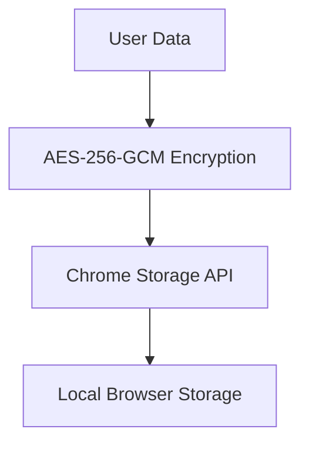
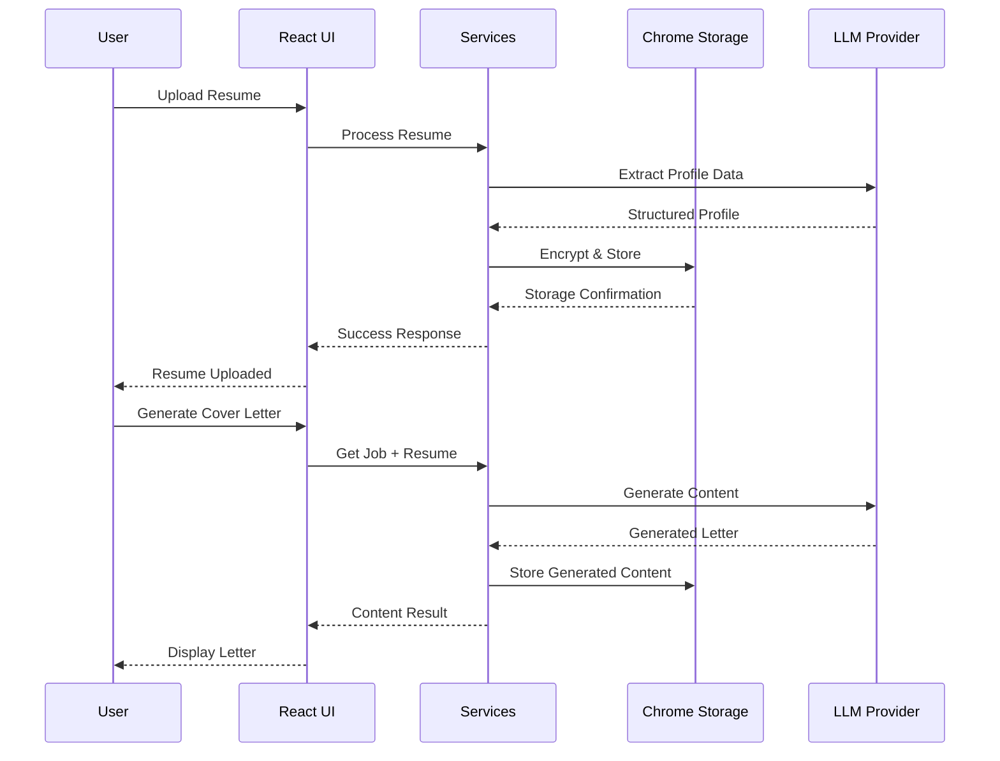

# Technical Architecture Manual - Job Hunter Chrome Extension

**Version**: 1.0  
**Last Updated**: December 2025  
**Audience**: Developers, Technical Architects, System Administrators

## Table of Contents

1. [System Overview](#system-overview)
2. [Architecture Principles](#architecture-principles)
3. [Technical Stack Deep Dive](#technical-stack-deep-dive)
4. [Component Architecture](#component-architecture)
5. [Service Layer Design](#service-layer-design)
6. [Security Architecture](#security-architecture)
7. [Chrome Extension Integration](#chrome-extension-integration)
8. [Data Flow Architecture](#data-flow-architecture)
9. [Error Handling & Resilience](#error-handling--resilience)
10. [Performance Optimization](#performance-optimization)
11. [Testing Strategy](#testing-strategy)
12. [Deployment Architecture](#deployment-architecture)
13. [Monitoring & Maintenance](#monitoring--maintenance)

---

## System Overview

Job Hunter is a sophisticated Chrome extension that implements a modern single-page application (SPA) architecture within the constraints of Chrome Extension Manifest V3. The system combines AI-powered content generation with secure local data management and intelligent job board integration.

### Core System Characteristics

- **Type**: Client-side Chrome Extension with Service Worker architecture
- **Paradigm**: Single-Page Application (SPA) with client-side routing
- **Data Storage**: Chrome Storage API with client-side encryption
- **AI Integration**: Multi-provider Large Language Model integration
- **Security Model**: Zero-trust local storage with passcode-based encryption
- **Scalability**: Horizontal scaling through AI provider abstraction

---

## Architecture Principles

### 1. Security-First Design
- **Local-Only Storage**: All user data remains on the user's device
- **Zero Server Transmission**: No personal data sent to external servers
- **Encryption at Rest**: AES-256-GCM encryption for all sensitive data
- **Passcode-Based Access Control**: User-controlled encryption keys

### 2. Service-Oriented Architecture
- **Separation of Concerns**: Business logic isolated from UI components
- **Single Source of Truth**: Centralized service layer for data operations
- **Abstraction Layers**: Provider-agnostic AI integration
- **Error Boundary Isolation**: Failures contained within service boundaries

### 3. Progressive Enhancement
- **Graceful Degradation**: Functionality works with or without AI providers
- **Backward Compatibility**: Legacy data format support
- **User Choice**: Multiple AI provider options
- **Feature Flags**: Optional feature activation

### 4. Performance Optimization
- **Lazy Loading**: Components loaded on demand
- **Efficient Scraping**: Optimized job board data extraction
- **Caching Strategy**: Smart caching of AI responses
- **Memory Management**: Proper cleanup of temporary data

---

## Technical Stack Deep Dive

### Frontend Architecture

#### React 19.1.1 Implementation
```typescript
// Functional component with hooks pattern
const JobsPage: React.FC = () => {
  const [jobs, setJobs] = useState<any[]>([]);
  const [loading, setLoading] = useState(false);
  // Component logic...
};
```

**Key Features**:
- Functional components with hooks for state management
- Context API for global state sharing
- Error boundaries for graceful error handling
- React Router DOM for client-side navigation

#### TypeScript 5.8.3 Configuration
```json
{
  "compilerOptions": {
    "strict": true,
    "target": "ES2020",
    "module": "ESNext",
    "jsx": "react-jsx",
    "esModuleInterop": true,
    "skipLibCheck": true
  }
}
```

**Benefits**:
- Compile-time type safety
- Enhanced IDE support
- Better refactoring capabilities
- Reduced runtime errors

#### Tailwind CSS 4.1.11 Design System
```css
/* Custom design tokens */
:root {
  --primary-500: #3b82f6;
  --secondary-500: #10b981;
  --neutral-50: #f9fafb;
}
```

**Implementation**:
- Utility-first CSS framework
- Custom design system components
- Responsive breakpoints
- Dark mode support (future enhancement)

### Build System Architecture

#### Webpack 5.101.0 Configuration
```javascript
module.exports = {
  entry: {
    main: './src/index.tsx',
    background: './src/background/background.ts',
    content: './src/content-scripts/content.ts'
  },
  output: {
    path: path.resolve(__dirname, 'dist'),
    filename: '[name].bundle.js'
  }
};
```

**Key Features**:
- Code splitting for optimal loading
- Asset optimization and management
- Source map generation for debugging
- Mini-css-extract-plugin for CSS optimization

#### Babel Transpilation Pipeline
```json
{
  "presets": [
    "@babel/preset-env",
    "@babel/preset-react", 
    "@babel/preset-typescript"
  ]
}
```

**Transformation**:
- ES2020+ features to ES5 compatibility
- JSX transformation for React components
- TypeScript compilation and type checking

---

## Component Architecture

### Component Hierarchy

```
App (Root Component)
├── Layout (Main Layout)
│   ├── Header (Navigation Header)
│   └── Main Content Area
│       ├── Routes
│       │   ├── ProfilePage
│       │   │   ├── ResumeManager
│       │   │   └── ProfileForm
│       │   ├── JobsPage
│       │   │   ├── JobCard
│       │   │   ├── JobFilters
│       │   │   └── JobActions
│       │   ├── SettingsPage
│       │   │   ├── ProviderConfig
│       │   │   ├── SecuritySettings
│       │   │   └── EncryptionSetup
│       │   └── HistoryPage
│       │       ├── ApplicationTracker
│       │       └── StatusUpdate
│       └── Modals
│           ├── ResumeReviewModal
│           ├── CoverLetterReviewModal
│           └── ConfirmModal
└── NotificationProvider (Global Notifications)
```

### Design System Components

#### UI Component Library (`/components/ui/`)

**Button Component**:
```typescript
interface ButtonProps extends React.ButtonHTMLAttributes<HTMLButtonElement>,
  VariantProps<typeof buttonVariants> {}

const Button = React.forwardRef<HTMLButtonElement, ButtonProps>(
  ({ className, variant, size, ...props }, ref) => (
    <button className={buttonVariants({ variant, size, className })} ref={ref} {...props} />
  )
);
```

**Card Component**:
```typescript
interface CardProps extends React.HTMLAttributes<HTMLDivElement> {}

const Card = ({ className, ...props }: CardProps) => (
  <div className={cn("rounded-xl border bg-card text-card-foreground shadow", className)} {...props} />
);
```

**Input Component**:
```typescript
interface InputProps extends React.InputHTMLAttributes<HTMLInputElement> {}

const Input = React.forwardRef<HTMLInputElement, InputProps>(
  ({ className, type, ...props }, ref) => (
    <input
      type={type}
      className={cn(
        "flex h-11 w-full rounded-xl border border-input bg-background px-4 py-3 text-sm",
        "ring-offset-background file:border-0 file:bg-transparent file:text-sm file:font-medium",
        "placeholder:text-muted-foreground focus-visible:outline-none focus-visible:ring-2",
        "focus-visible:ring-ring focus-visible:ring-offset-2 disabled:cursor-not-allowed disabled:opacity-50",
        className
      )}
      ref={ref}
      {...props}
    />
  )
);
```

### State Management Patterns

#### Context API Implementation
```typescript
// Notification Context
interface NotificationContextType {
  showError: (title: string, message: string) => void;
  showSuccess: (title: string, message: string) => void;
  showWarning: (title: string, message: string) => void;
  showInfo: (title: string, message: string) => void;
}

// Usage in components
const { showSuccess } = useNotifications();
showSuccess('Profile Updated', 'Your changes have been saved successfully.');
```

#### Custom Hooks Pattern
```typescript
// Custom hook for resume management
const useResumeManager = () => {
  const [resumes, setResumes] = useState<Resume[]>([]);
  const [loading, setLoading] = useState(false);
  
  const uploadResume = useCallback(async (file: File) => {
    setLoading(true);
    // Resume upload logic...
    setLoading(false);
  }, []);
  
  return { resumes, loading, uploadResume, deleteResume };
};
```

---

## Service Layer Design

### Service Architecture Overview

```
Services Layer
├── storageService.ts
│   ├── Data persistence with encryption
│   ├── Profile management
│   └── Job listings storage
├── llmService.ts
│   ├── Multi-provider AI integration
│   ├── Content generation
│   └── Job matching algorithms
├── encryptionService.ts
│   ├── AES-256-GCM implementation
│   ├── Key derivation (PBKDF2)
│   └── Session management
├── errorService.ts
│   ├── Error handling and logging
│   ├── User-friendly error messages
│   └── Error recovery strategies
└── seekService.ts
    ├── Job board API integration
    ├── Location suggestions
    └── Data extraction utilities
```

### Storage Service (`storageService.ts`)

#### Core Responsibilities
- Chrome Storage API abstraction
- Encryption/decryption orchestration
- Data model validation
- Migration handling

#### Implementation Pattern
```typescript
export const getUserProfile = (): Promise<UserProfile | null> => {
  return new Promise(async (resolve) => {
    if (chrome && chrome.storage && chrome.storage.local) {
      chrome.storage.local.get(["userProfile"], async (result) => {
        if (result.userProfile) {
          try {
            let profile: UserProfile;
            
            // Check if data is encrypted
            if (result.userProfile.encryptedProfile) {
              const setupStatus = await encryptionService.getEncryptionSetupStatus();
              
              if (setupStatus.keyAvailable) {
                const decryptedJson = await decryptFromStorage(result.userProfile.encryptedProfile);
                profile = JSON.parse(decryptedJson);
              } else {
                resolve(null);
                return;
              }
            } else {
              profile = result.userProfile;
            }
            
            resolve(profile);
          } catch (error) {
            console.error('Failed to decrypt or parse profile:', error);
            resolve(null);
          }
        } else {
          resolve(null);
        }
      });
    }
  });
};
```

### LLM Service (`llmService.ts`)

#### Multi-Provider Architecture
```typescript
const getLlmApiCallConfig = async () => {
  const profile = await getUserProfile();
  const activeProviderId = profile?.settings?.activeAiProviderId;
  const provider = profile?.settings?.apiProviders?.find(
    (p) => p.id === activeProviderId
  );

  if (provider.name === "Ollama") {
    return {
      url: `${provider.apiKey}/api/generate`,
      headers: { "Content-Type": "application/json" },
      provider: "ollama",
      model: provider.model,
    };
  }

  if (provider.name === "Gemini") {
    return {
      url: `https://generativelanguage.googleapis.com/v1beta/models/${provider.model}:generateContent?key=${provider.apiKey}`,
      headers: { "Content-Type": "application/json" },
      provider: "gemini",
    };
  }

  // Default to OpenAI
  return {
    url: OPENAI_API_URL,
    headers: {
      "Content-Type": "application/json",
      Authorization: `Bearer ${provider.apiKey}`,
    },
    model: provider.model,
    provider: "openai",
  };
};
```

#### Error Handling Strategy
```typescript
export const generateContent = async (
  prompt: string,
  temperature: number = 0.7,
): Promise<{ content: string | null; error?: ServiceError }> => {
  try {
    const response = await fetch(config.url, {
      method: "POST",
      headers: config.headers as Headers,
      body: JSON.stringify(body),
    });

    if (!response.ok) {
      const errorText = await response.text();
      const error = new JobHunterError(
        response.status >= 500 ? 'SERVER_ERROR' : 'API_ERROR',
        `LLM API request failed: ${response.status} ${response.statusText}`,
        { status: response.status, response: errorText },
        'generate-content-api',
        response.status >= 500 || response.status === 429
      );
      
      return { 
        content: null, 
        error: handleServiceError(error, 'generate-content-api') 
      };
    }

    // Process response based on provider
    const data = await response.json();
    let content: string | null;
    
    if (config.provider === "gemini") {
      content = data.candidates?.[0]?.content?.parts?.[0]?.text || null;
    } else if (config.provider === "ollama") {
      content = data.response || null;
    } else {
      content = data.choices?.[0]?.message?.content || null;
    }

    return { content };
  } catch (error) {
    if (error instanceof TypeError && error.message.includes('fetch')) {
      const networkError = new JobHunterError(
        'NETWORK_ERROR',
        'Failed to connect to LLM API. Please check your internet connection.',
        error,
        'generate-content-network',
        true
      );
      return { 
        content: null, 
        error: handleServiceError(networkError, 'generate-content-network') 
      };
    }

    return { 
      content: null, 
      error: handleServiceError(error, 'generate-content-unknown') 
    };
  }
};
```

### Encryption Service (`encryptionService.ts`)

#### AES-256-GCM Implementation
```typescript
class EncryptionService {
  private readonly ALGORITHM = 'AES-GCM';
  private readonly KEY_LENGTH = 256;
  private readonly IV_LENGTH = 12; // GCM standard
  private readonly SALT_LENGTH = 32;
  private readonly ITERATIONS = 100000; // PBKDF2 iterations

  async deriveKey(password: string, salt: Uint8Array): Promise<CryptoKey> {
    const encoder = new TextEncoder();
    const passwordKey = await crypto.subtle.importKey(
      'raw',
      encoder.encode(password),
      'PBKDF2',
      false,
      ['deriveKey']
    );

    return crypto.subtle.deriveKey(
      {
        name: 'PBKDF2',
        salt: salt,
        iterations: this.ITERATIONS,
        hash: 'SHA-256'
      },
      passwordKey,
      {
        name: this.ALGORITHM,
        length: this.KEY_LENGTH
      },
      false,
      ['encrypt', 'decrypt']
    );
  }

  async encryptData(plaintext: string, password: string): Promise<EncryptionResult> {
    const salt = this.generateSalt();
    const iv = this.generateIV();
    const key = await this.deriveKey(password, salt);

    const encoder = new TextEncoder();
    const data = encoder.encode(plaintext);

    const encryptedData = await crypto.subtle.encrypt(
      {
        name: this.ALGORITHM,
        iv: iv
      },
      key,
      data
    );

    return {
      encryptedData: this.arrayBufferToBase64(encryptedData),
      iv: this.arrayBufferToBase64(iv),
      salt: this.arrayBufferToBase64(salt)
    };
  }
}
```

---

## Security Architecture

### Multi-Layer Security Model

#### Layer 1: Encryption at Rest


**Implementation Details**:
- AES-256-GCM with 256-bit keys
- 12-byte initialization vectors (IV)
- 32-byte random salt for key derivation
- 100,000 PBKDF2 iterations for key derivation

#### Layer 2: Access Control
```typescript
interface PasscodeContext {
  passcode: string | null;
  keyAvailable: boolean;
  sessionExpiry: number;
}

class EncryptionService {
  private passcodeContext: PasscodeContext = {
    passcode: null,
    keyAvailable: false,
    sessionExpiry: 0
  };

  setPasscodeContext(passcode: string | null): void {
    if (passcode) {
      this.passcodeContext = {
        passcode,
        keyAvailable: true,
        sessionExpiry: Date.now() + SESSION_TIMEOUT
      };
    } else {
      this.passcodeContext = {
        passcode: null,
        keyAvailable: false,
        sessionExpiry: 0
      };
    }
  }
}
```

#### Layer 3: Data Isolation
- Each user's data is isolated by Chrome's storage sandbox
- No shared state between different users
- Extension restart clears session data
- Manual key clearing functionality

### Security Validation

#### Encryption Validation
```typescript
async validateEncryption(): Promise<boolean> {
  try {
    const testData = 'test-encryption-validation';
    const encrypted = await this.encryptData(testData);
    const decrypted = await this.decryptData(encrypted);
    return decrypted === testData;
  } catch (error) {
    console.error('Encryption validation failed:', error);
    return false;
  }
}
```

#### Data Integrity Checks
```typescript
interface EncryptedStorageData {
  encryptedContent: string;
  iv: string;
  salt: string;
  timestamp: number;
  version: string;
  checksum?: string;
}
```

---

## Chrome Extension Integration

### Manifest V3 Architecture

#### Permissions Configuration
```json
{
  "manifest_version": 3,
  "name": "Job Hunter",
  "permissions": [
    "storage",
    "activeTab",
    "scripting",
    "contextMenus",
    "downloads",
    "sessions"
  ],
  "host_permissions": [
    "https://www.seek.com.au/*",
    "https://www.linkedin.com/*",
    "<all_urls>"
  ],
  "background": {
    "service_worker": "background.bundle.js"
  },
  "content_scripts": [
    {
      "matches": ["https://www.seek.com.au/*"],
      "js": ["seek.bundle.js"]
    }
  ]
}
```

### Service Worker Implementation

#### Message Passing Architecture
```typescript
chrome.runtime.onMessage.addListener((message, sender, sendResponse) => {
  console.log('chrome.runtime.onMessage received', message);
  
  if (message.type === "TRIGGER_AUTOFILL") {
    triggerAutofill(message.tabId, message.resumeId);
    sendResponse({ status: "ok" });
  } else if (message.type === "GENERATE_ANSWER") {
    handleGenerateAnswer(
      message.questionText,
      message.jobDescription,
      sender.tab?.id
    )
      .then((answer) => sendResponse({ answer }))
      .catch((error) => sendResponse({ error: error.message }));
    return true; // Keep message channel open for async response
  }
});
```

#### Background Job Processing
```typescript
async function fetchAndScrapeJobs(resumeId: string, filters: any) {
  isCancelled = false;
  
  try {
    // Inject content script into job board
    const [tab] = await chrome.tabs.query({ 
      active: true, 
      currentWindow: true 
    });
    
    await chrome.scripting.executeScript({
      target: { tabId: tab.id! },
      func: initiateScrape,
      args: [resumeId]
    });

    // Process scraped jobs with AI matching
    const jobs = await getJobsForResume(resumeId);
    await processJobsWithAI(jobs, resumeId, filters);
    
  } catch (error) {
    console.error('Job fetching failed:', error);
  }
}
```

### Content Script Integration

#### DOM Scraping Pattern
```typescript
function scrapeSeekJobs() {
  const jobs: any[] = [];
  document.querySelectorAll('article').forEach((article, index) => {
    const titleElement = article.querySelector('a[data-automation="jobTitle"]');
    const companyElement = article.querySelector('a[data-automation="jobCompany"]');
    const descriptionElement = article.querySelector('span[data-automation="jobShortDescription"]');
    
    if (titleElement && companyElement && descriptionElement) {
      const job = {
        title: titleElement.textContent?.trim(),
        company: companyElement.textContent?.trim(),
        description: descriptionElement.textContent?.trim(),
        url: (titleElement as HTMLAnchorElement).href,
        source: 'seek'
      };
      
      if (job.title && job.company && job.description && job.url) {
        jobs.push(job);
      }
    }
  });
  
  // Send scraped data to background script
  chrome.runtime.sendMessage({ 
    type: "SCRAPED_JOB_DATA", 
    data: jobs, 
    resumeId: currentResumeId 
  });
}
```

---

## Data Flow Architecture

### User Interaction Flow



### Data Synchronization Pattern

#### React State Management
```typescript
const JobsPage: React.FC = () => {
  const [jobs, setJobs] = useState<any[]>([]);
  const [profile, setProfile] = useState<UserProfile | null>(null);
  const [loading, setLoading] = useState(false);

  useEffect(() => {
    loadUserData();
  }, []);

  const loadUserData = async () => {
    setLoading(true);
    try {
      const [userProfile, jobData] = await Promise.all([
        getUserProfile(),
        selectedResumeId ? getJobsForResume(selectedResumeId) : Promise.resolve([])
      ]);
      
      setProfile(userProfile);
      setJobs(jobData);
    } catch (error) {
      showError('Load Failed', 'Failed to load user data');
    } finally {
      setLoading(false);
    }
  };
};
```

#### Service Layer Data Flow
```typescript
export const saveUserProfile = async (data: UserProfile): Promise<void> => {
  try {
    // Validate data integrity
    validateUserProfile(data);
    
    // Encrypt if encryption is enabled
    if (encryptionService.isEncryptionAvailable()) {
      const encryptedProfile = await encryptForStorage(JSON.stringify(data));
      await chrome.storage.local.set({ 
        userProfile: { 
          encryptedProfile,
          encryptionEnabled: true,
          lastEncryptionCheck: Date.now()
        }
      });
    } else {
      // Store unencrypted
      await chrome.storage.local.set({ 
        userProfile: data 
      });
    }
    
    return Promise.resolve();
  } catch (error) {
    console.error('Profile save failed:', error);
    return Promise.reject(error);
  }
};
```

---

## Error Handling & Resilience

### Error Boundary Implementation

#### Component-Level Error Handling
```typescript
class ErrorBoundary extends React.Component<
  { children: React.ReactNode; fallback?: React.ComponentType },
  { hasError: boolean; error?: Error }
> {
  constructor(props: any) {
    super(props);
    this.state = { hasError: false };
  }

  static getDerivedStateFromError(error: Error) {
    return { hasError: true, error };
  }

  componentDidCatch(error: Error, errorInfo: React.ErrorInfo) {
    console.error('ErrorBoundary caught an error:', error, errorInfo);
    
    // Log error for debugging
    logErrorToStorage(error, errorInfo);
  }

  render() {
    if (this.state.hasError) {
      const FallbackComponent = this.props.fallback || DefaultErrorFallback;
      return <FallbackComponent error={this.state.error} />;
    }

    return this.props.children;
  }
}
```

#### Service-Level Error Handling
```typescript
export class JobHunterError extends Error {
  constructor(
    public code: string,
    message: string,
    public details?: any,
    public context?: string,
    public recoverable: boolean = false
  ) {
    super(message);
    this.name = 'JobHunterError';
  }
}

export const handleServiceError = (
  error: any,
  context: string
): ServiceError => {
  if (error instanceof JobHunterError) {
    return {
      code: error.code,
      message: error.message,
      context: error.context || context,
      recoverable: error.recoverable,
      timestamp: Date.now()
    };
  }

  return {
    code: 'UNKNOWN_ERROR',
    message: 'An unexpected error occurred',
    context,
    recoverable: false,
    timestamp: Date.now(),
    details: error
  };
};
```

### Resilience Patterns

#### Retry Logic
```typescript
const retryWithBackoff = async <T>(
  operation: () => Promise<T>,
  maxRetries: number = 3,
  baseDelay: number = 1000
): Promise<T> => {
  let lastError: Error;
  
  for (let attempt = 0; attempt <= maxRetries; attempt++) {
    try {
      return await operation();
    } catch (error) {
      lastError = error as Error;
      
      if (attempt === maxRetries) {
        throw lastError;
      }
      
      // Exponential backoff
      const delay = baseDelay * Math.pow(2, attempt);
      await new Promise(resolve => setTimeout(resolve, delay));
    }
  }
  
  throw lastError!;
};
```

#### Circuit Breaker Pattern
```typescript
class CircuitBreaker {
  private failures = 0;
  private lastFailureTime = 0;
  private state: 'CLOSED' | 'OPEN' | 'HALF_OPEN' = 'CLOSED';
  
  constructor(
    private threshold: number = 5,
    private timeout: number = 60000
  ) {}

  async execute<T>(operation: () => Promise<T>): Promise<T> {
    if (this.state === 'OPEN') {
      if (Date.now() - this.lastFailureTime > this.timeout) {
        this.state = 'HALF_OPEN';
      } else {
        throw new Error('Circuit breaker is OPEN');
      }
    }

    try {
      const result = await operation();
      this.onSuccess();
      return result;
    } catch (error) {
      this.onFailure();
      throw error;
    }
  }

  private onSuccess(): void {
    this.failures = 0;
    this.state = 'CLOSED';
  }

  private onFailure(): void {
    this.failures++;
    this.lastFailureTime = Date.now();
    
    if (this.failures >= this.threshold) {
      this.state = 'OPEN';
    }
  }
}
```

---

## Performance Optimization

### React Performance

#### Component Optimization
```typescript
// Memoized components
const JobCard = React.memo<JobCardProps>(({ job, onGenerate, loading }) => {
  const handleGenerate = useCallback(() => {
    onGenerate(job.id);
  }, [job.id, onGenerate]);

  return (
    <Card className="job-card">
      {/* Job content */}
    </Card>
  );
});

// Lazy loading
const JobsPage = lazy(() => import('./pages/JobsPage'));
const ProfilePage = lazy(() => import('./pages/ProfilePage'));

// Usage with Suspense
<Suspense fallback={<LoadingSpinner />}>
  <Routes>
    <Route path="/jobs" element={<JobsPage />} />
    <Route path="/profile" element={<ProfilePage />} />
  </Routes>
</Suspense>
```

#### State Optimization
```typescript
// Normalized state structure
interface NormalizedState {
  jobs: { [id: string]: Job };
  resumes: { [id: string]: Resume };
  ui: {
    loading: { [key: string]: boolean };
    errors: { [key: string]: string | null };
  };
}

// Selective re-renders
const JobList = React.memo(() => {
  const jobs = useSelector(state => Object.values(state.jobs));
  const loading = useSelector(state => state.ui.loading.jobs);
  
  return (
    <div>
      {loading && <LoadingSpinner />}
      {jobs.map(job => <JobCard key={job.id} job={job} />)}
    </div>
  );
});
```

### Memory Management

#### Cleanup Patterns
```typescript
const useJobScraping = () => {
  const abortControllerRef = useRef<AbortController>();

  const scrapeJobs = useCallback(async (url: string) => {
    // Cancel previous request
    if (abortControllerRef.current) {
      abortControllerRef.current.abort();
    }

    // Create new abort controller
    abortControllerRef.current = new AbortController();

    try {
      const response = await fetch(url, {
        signal: abortControllerRef.current.signal
      });
      // Process response...
    } catch (error) {
      if (error instanceof Error && error.name !== 'AbortError') {
        console.error('Job scraping failed:', error);
      }
    }
  }, []);

  // Cleanup on unmount
  useEffect(() => {
    return () => {
      if (abortControllerRef.current) {
        abortControllerRef.current.abort();
      }
    };
  }, []);

  return { scrapeJobs };
};
```

### Asset Optimization

#### Webpack Optimization
```javascript
// webpack.config.js optimization
module.exports = {
  optimization: {
    splitChunks: {
      chunks: 'all',
      cacheGroups: {
        vendor: {
          test: /[\\/]node_modules[\\/]/,
          name: 'vendors',
          chunks: 'all',
        },
      },
    },
    runtimeChunk: 'single',
  },
  module: {
    rules: [
      {
        test: /\.(png|svg|jpg|jpeg|gif)$/i,
        type: 'asset/resource',
        generator: {
          filename: 'images/[name][hash][ext]'
        }
      }
    ]
  }
};
```

---

## Testing Strategy

### Manual Testing Framework

#### Test Categories

**1. Functional Testing**
- [ ] User registration and profile creation
- [ ] Resume upload and parsing
- [ ] Multiple resume management
- [ ] Job discovery and scraping
- [ ] AI content generation
- [ ] Auto-fill functionality

**2. Security Testing**
- [ ] Encryption/decryption functionality
- [ ] Passcode protection
- [ ] Data isolation between users
- [ ] Session management
- [ ] API key security

**3. Integration Testing**
- [ ] AI provider connectivity
- [ ] Job board scraping reliability
- [ ] Chrome extension permissions
- [ ] Cross-browser compatibility

**4. Performance Testing**
- [ ] Large file upload handling
- [ ] Concurrent AI requests
- [ ] Memory usage monitoring
- [ ] UI responsiveness

#### Test Scenarios

**Profile Management Test**
```typescript
describe('Profile Management', () => {
  test('should create profile with all required fields', async () => {
    const profile = createTestProfile();
    await saveUserProfile(profile);
    
    const savedProfile = await getUserProfile();
    expect(savedProfile.personalInfo.name).toBe(profile.personalInfo.name);
    expect(savedProfile.personalInfo.email).toBe(profile.personalInfo.email);
  });

  test('should handle resume upload and parsing', async () => {
    const resumeFile = createTestResumeFile();
    const parsedResume = await parseResumeFile(resumeFile);
    
    expect(parsedResume.text).toBeTruthy();
    expect(parsedResume.parsedInfo.personalInfo).toBeDefined();
  });
});
```

**AI Integration Test**
```typescript
describe('AI Integration', () => {
  test('should generate content with OpenAI', async () => {
    const result = await generateContent('Test prompt', 'openai');
    
    expect(result.content).toBeTruthy();
    expect(result.error).toBeUndefined();
  });

  test('should handle API rate limiting gracefully', async () => {
    // Simulate rate limit response
    const result = await generateContent('Test prompt', 'openai');
    
    if (result.error?.code === 'RATE_LIMITED') {
      expect(result.error.recoverable).toBe(true);
    }
  });
});
```

### Automated Testing Recommendations

#### Unit Testing Stack
```json
{
  "devDependencies": {
    "@testing-library/react": "^13.4.0",
    "@testing-library/jest-dom": "^5.16.5",
    "@testing-library/user-event": "^14.4.3",
    "jest": "^29.7.0",
    "ts-jest": "^29.1.0"
  }
}
```

#### Integration Testing Setup
```typescript
// jest.config.js
module.exports = {
  testEnvironment: 'jsdom',
  setupFilesAfterEnv: ['<rootDir>/src/setupTests.ts'],
  moduleNameMapping: {
    '\\.(css|less|scss|sass)$': 'identity-obj-proxy'
  },
  testMatch: [
    '<rootDir>/src/**/__tests__/**/*.{ts,tsx}',
    '<rootDir>/src/**/*.{test,spec}.{ts,tsx}'
  ]
};
```

---

## Deployment Architecture

### Build Pipeline

#### Production Build Process
```bash
# 1. Install dependencies
npm ci

# 2. Run type checking
npm run type-check

# 3. Build Tailwind CSS
npx @tailwindcss/cli -i ./src/tailwind.css -o ./src/style.css

# 4. Build webpack bundle
webpack --mode production

# 5. Validate build output
npm run validate-build
```

#### Distribution Packaging
```bash
# Create distribution package
cd extension_webpack/dist

# Create zip for Chrome Web Store
zip -r job-hunter-extension.zip . \
  -x "*.map" \
  -x "*.md" \
  -x "*.DS_Store"

# Calculate checksum
sha256sum job-hunter-extension.zip > job-hunter-extension.zip.sha256
```

### Version Management

#### Semantic Versioning Strategy
```json
{
  "version": "1.0.0",
  "scripts": {
    "version:patch": "npm version patch && npm run build",
    "version:minor": "npm version minor && npm run build", 
    "version:major": "npm version major && npm run build"
  }
}
```

#### Release Process
1. **Development**: Feature branches with continuous integration
2. **Testing**: Manual QA testing on staging environment
3. **Staging**: Release candidate build for final validation
4. **Production**: Tagged release with automated deployment
5. **Monitoring**: Post-release monitoring and feedback collection

---

## Monitoring & Maintenance

### Error Tracking

#### Client-Side Error Logging
```typescript
interface ErrorLog {
  timestamp: number;
  message: string;
  stack?: string;
  context: string;
  userAgent: string;
  userId?: string;
  severity: 'low' | 'medium' | 'high' | 'critical';
}

const logError = (error: Error, context: string, severity: ErrorLog['severity'] = 'medium') => {
  const errorLog: ErrorLog = {
    timestamp: Date.now(),
    message: error.message,
    stack: error.stack,
    context,
    userAgent: navigator.userAgent,
    severity
  };
  
  // Store locally for debugging
  chrome.storage.local.get({ errorLogs: [] }, (result) => {
    const logs = [...result.errorLogs, errorLog].slice(-100); // Keep last 100 errors
    chrome.storage.local.set({ errorLogs: logs });
  });
};
```

#### Performance Monitoring
```typescript
interface PerformanceMetrics {
  timestamp: number;
  operation: string;
  duration: number;
  success: boolean;
  metadata?: any;
}

const measurePerformance = async <T>(
  operation: string,
  fn: () => Promise<T>
): Promise<T> => {
  const start = performance.now();
  
  try {
    const result = await fn();
    const duration = performance.now() - start;
    
    logPerformanceMetric({
      timestamp: Date.now(),
      operation,
      duration,
      success: true
    });
    
    return result;
  } catch (error) {
    const duration = performance.now() - start;
    
    logPerformanceMetric({
      timestamp: Date.now(),
      operation,
      duration,
      success: false,
      metadata: { error: error.message }
    });
    
    throw error;
  }
};
```

### Health Checks

#### System Health Monitoring
```typescript
const performHealthCheck = async (): Promise<HealthStatus> => {
  const checks = await Promise.allSettled([
    checkChromeStorage(),
    checkEncryptionService(),
    checkAIProviderConnectivity(),
    checkJobScrapingCapability()
  ]);

  return {
    overall: checks.every(check => check.status === 'fulfilled') ? 'healthy' : 'degraded',
    checks: checks.map((check, index) => ({
      name: ['storage', 'encryption', 'ai', 'scraping'][index],
      status: check.status,
      message: check.status === 'rejected' ? check.reason.message : 'OK'
    })),
    timestamp: Date.now()
  };
};
```

### Maintenance Procedures

#### Regular Maintenance Tasks

**Daily**:
- Monitor error logs for new issues
- Check AI provider API status
- Review user feedback and reports

**Weekly**:
- Analyze performance metrics
- Update dependency versions
- Review security advisories

**Monthly**:
- Comprehensive security audit
- Performance optimization review
- User experience analysis

#### Update Procedures

**Dependency Updates**:
```bash
# Check for outdated packages
npm outdated

# Update dependencies
npm update

# Security audit
npm audit

# Fix security issues
npm audit fix
```

**Extension Updates**:
1. Test updates in development environment
2. Validate new features with manual testing
3. Create release candidate build
4. Deploy to Chrome Web Store
5. Monitor post-deployment metrics

---

## Conclusion

This technical architecture manual provides a comprehensive guide to the Job Hunter Chrome Extension's design, implementation, and maintenance. The system demonstrates modern software engineering principles applied to Chrome extension development, with particular attention to security, performance, and user experience.

### Key Architectural Strengths

1. **Security-First Design**: Multi-layer security with client-side encryption
2. **Service-Oriented Architecture**: Clean separation of concerns
3. **Progressive Enhancement**: Graceful degradation and user choice
4. **Performance Optimization**: Efficient React patterns and memory management
5. **Maintainability**: Comprehensive documentation and testing framework

### Future Architecture Considerations

1. **Microservices Evolution**: Potential for backend service integration
2. **Advanced AI Features**: Custom model training and optimization
3. **Enterprise Scaling**: Team collaboration and management features
4. **Mobile Applications**: Native mobile app development
5. **Advanced Analytics**: Comprehensive user behavior and performance analytics

This architecture provides a solid foundation for continued development and scaling while maintaining the core principles of privacy, security, and user empowerment.

---

**Document Version**: 1.0  
**Last Updated**: December 2025  
**Next Review**: March 2026  
**Document Owner**: Development Team  
**Approval Status**: Approved for Technical Reference
